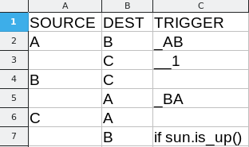
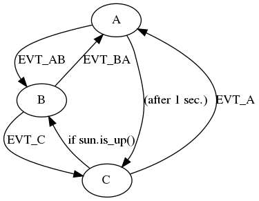

# sttp: state transition table parser
A tiny library for parsing state transition tables.

This library offers the following:
- parse a state transition table described in csv format
- print the state machine in JSON, DOT formats
- export a visualization of the state machine

## State transition table format
The format of the state transition table csv input:
| SOURCE      | DEST | TRIGGER |
| ----------- | ----------- | ------- |
| ``<text>`` or ``(empty)`` | ``<text>`` | ``<text>`` _or_ ``_<text>`` (event name) _or_ ``__<number>`` (seconds) _or_ ``(empty)`` |

**Explanation**:

```
SOURCE: source state name, or (empty) (assume same state as the previous line)
DEST: destination state name
TRIGGER: trigger string (e.g. if-else condition),
	event name (must be preceded by underscore),
	seconds until transition occurs (must be preceded by double underscore), or 
	(empty) (assume the dest state as event name)
```

**Example**:

An example of a valid state transition table csv file:



## Example usage

**JSONify** the state transition table:

```bash
./sttp.py resources/example_input.csv jsonify > resources/example_output.json
```

will produce the following file:

```
{
    "transitions": [
        {
            "trigger": "EVT_AB",
            "source": "A",
            "dest": "B"
        },
        {
            "trigger": "(after 1 sec.)",
            "source": "A",
            "dest": "C"
        },
        {
            "trigger": "EVT_C",
            "source": "B",
            "dest": "C"
        },
        {
            "trigger": "EVT_BA",
            "source": "B",
            "dest": "A"
        },
        {
            "trigger": "EVT_A",
            "source": "C",
            "dest": "A"
        },
        {
            "trigger": "if sun.is_up()",
            "source": "C",
            "dest": "B"
        }
    ]
}
```

**DOTify** the state transition table:

```bash
./sttp.py resources/example_input.csv dotify > resources/example_output.dot
```

will produce the following file:

```
digraph {
	A
	B
	A -> B [label=EVT_AB]
	A
	C
	A -> C [label="(after 1 sec.)"]
	B
	C
	B -> C [label=EVT_C]
	B
	A
	B -> A [label=EVT_BA]
	C
	A
	C -> A [label=EVT_A]
	C
	B
	C -> B [label="if sun.is_up()"]
}
```

**Visualize** stt:

```bash
./sttp.py resources/example_input.csv visualize --format png resources/example_output --view
```

will produce and bring into view the following image:



For more information:

```bash
./sttp.py -h
```
